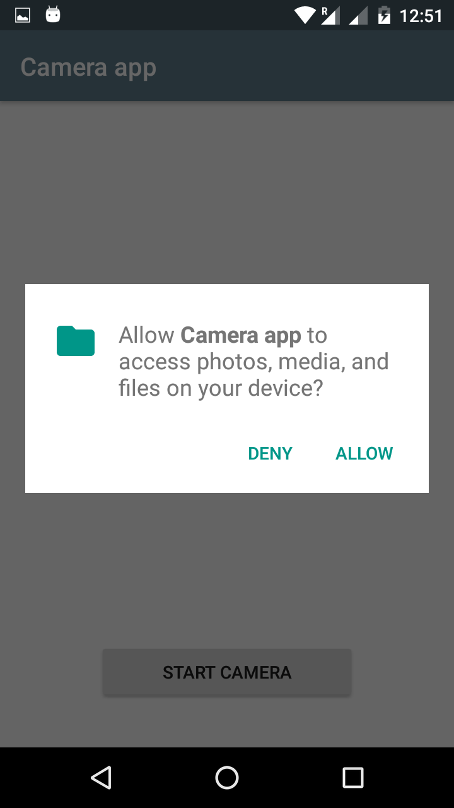
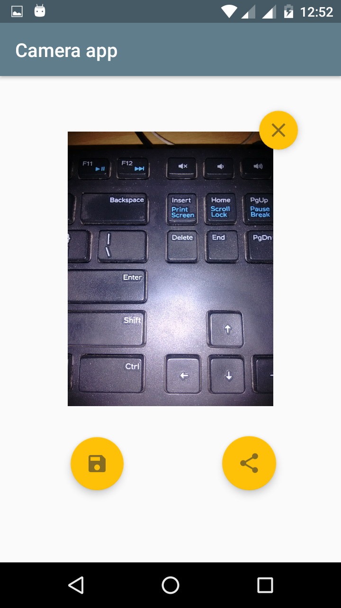

# Simple Camera app.

This is Simple Camera app that capture photo from the system camera app.
It show's you that:-

1) How to save image to the gallery app folder.
2) How to save image to temp or cache folder of your app.
3) How to Delete image from temp or cache folder of youe app.
4) How to Delete image from save on System location folder.
5) How to Resize image or Bitmap.
6) How to use Runtime permission on Android to gain access system storage.

## Screeshots:-

  

